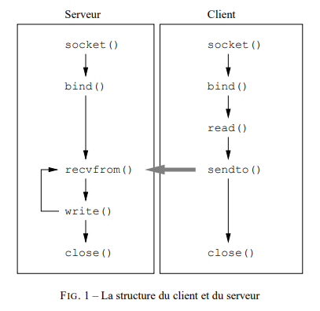
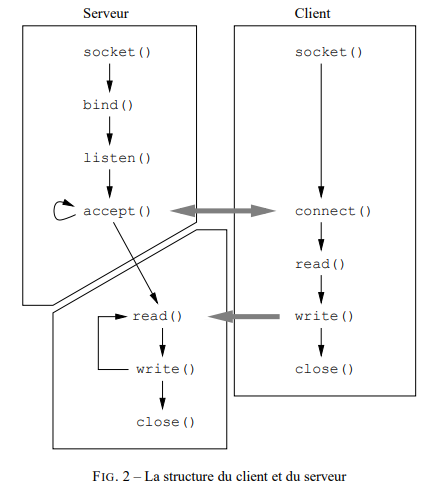

# LDD2-IM-Réseau

> TP 2 Programmation réseau : Etablir une communication client/serveur en UDP et TCP


## Objectif du TP
L'objectif de ce TP est de développer une communication rudimentaire entre deux processus, en adoptant une architecture de type client / serveur. La communication repose sur l'interface des sockets.
Une première partie est consacrée au mode UDP (datagrammes) et une seconde au mode TCP (orienté flux).


---


## Partie 1 : UDP

### Structure
- `client_udp.c`
- `serveur_udp.c`

---

### Étapes



---

### Utilisation

#### Compilation
```bash
gcc serveur_udp.c -o serveur_udp
gcc client_udp.c -o client_udp
```

#### Exécution
1. Lancer le serveur dans un premier terminal :
```bash
./serveur_udp [port]
```

2. Lancer le client dans un second terminal :
```bash
./client_udp [adresse_ip] [port]
```

Exemple en local :
```bash
./client_udp 127.0.0.1 9600
```

- `adresse_ip` : adresse IP du serveur (`127.0.0.1` en local)
- `port` : port d'écoute du serveur (par défaut `9600`)

---

## Partie 2 : TCP

### Structure
- `client_tcp.c`
- `serveur_tcp.c`

---

### Étapes



---

### Utilisation

#### Compilation
```bash
gcc serveur_tcp.c -o serveur_tcp
gcc client_tcp.c -o client_tcp
```

#### Exécution
1. Lancer le serveur dans un premier terminal :
```bash
./serveur_tcp
```

2. Lancer le client dans un second terminal :
```bash
./client_tcp [adresse_ip] [port]
```

Exemple en local :
```bash
./client_tcp 127.0.0.1 9600
```

- `adresse_ip` : adresse IP du serveur (`127.0.0.1` en local)
- `port` : port d'écoute du serveur (par défaut `9600`)

---


# Fonctionnalités ajoutées en plus 
 - Port et adresse IP donnés en arguments (optionnels).
 - Dans la partie II, la taille du message est plus grande que 20 octets.
Elle peut aller jusqu'à 65 535 octets. On a créé ici un serializer et un deserializer. 
La structure du chat est la suivante:
   - Taille du message (2 octets, big-endian)
   - Nom de la personne (20 octets)
   - Message (dépend de la taille)
   
   Ainsi, on attend qu'on reçoive les 2 octets puis les 20 octets (l'ensemble constitue le header de notre application simple) pour
pouvoir obtenir le message complet. Le serveur répondra par 'K' (OK) pour acquitter.
Le serveur peut aussi voir si un client se déconnecte et gérer plusieurs clients à la fois.
En réalité, pour des choses plus complexes, un header pourrait être: commandId (1 octet) + taille (2 octets) par exemple.
 - Codes couleurs lors d'affichages: les erreurs sont en rouges. Sur la partie II,
les messages envoyés ou donnés à titre d'information par le serveur sont en bleus.

---

## Auteurs
- LEANDRI Pierre
- FUSIL Julian
- Formation : LDD2 IM2
